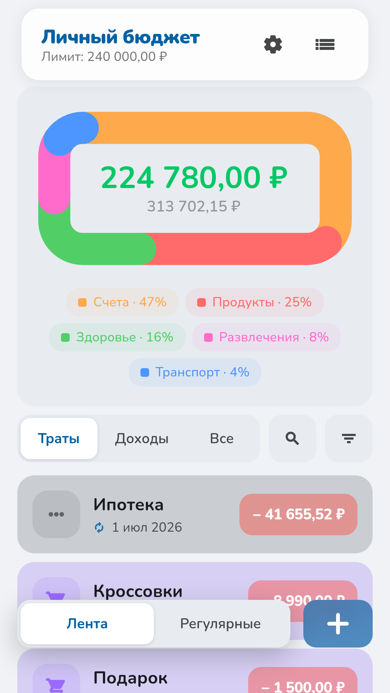
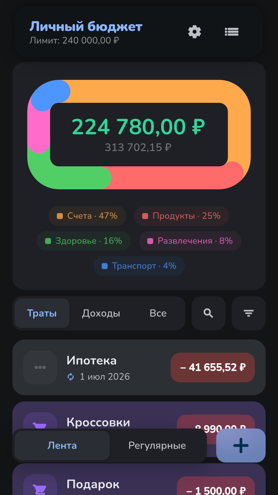
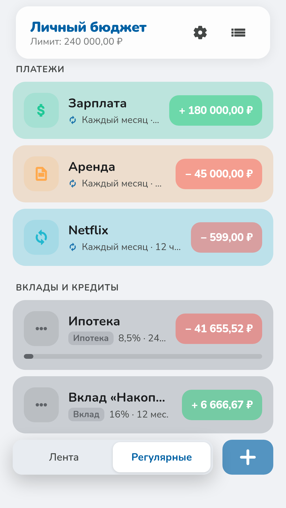
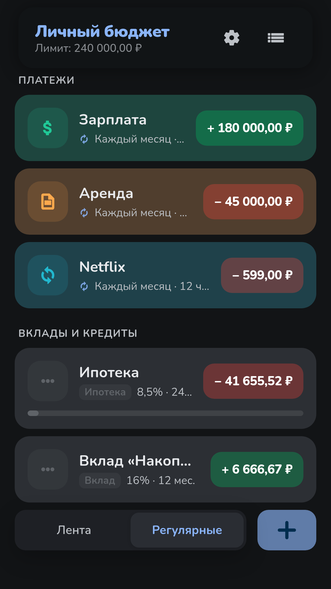

# Plyet

A personal budget app built with Tauri 2, SvelteKit, and SQLite. Track income
and expenses, recurring payments (subscriptions, salary, rent), and financial
products (deposits, loans, mortgages) — with a glassy, theme-able UI.

> The interface is in Russian.

<p align="center">
  
  
  
  
</p>

## Features

- **Feed** — income/expense items with categories, a donut balance chart, and
  search/filter.
- **Recurring** — subscriptions, salary, and rent that recur on a schedule.
- **Financial products** — deposits, loans, and mortgages with interest,
  annuity, and early-repayment modeling.
- **Theming** — light/dark themes, accent colors, glass blur and transparency
  toggles.
- **Local-first** — all data lives in a local SQLite database; no account, no
  cloud.

## Tech stack

- **Frontend:** SvelteKit (Svelte 5 runes) + `@sveltejs/adapter-static`
- **Shell:** Tauri 2 (Rust)
- **Storage:** SQLite (`rusqlite`, bundled)
- **UI kit:** `reglass-material` (local workspace package under `packages/`)
- **Tooling:** pnpm workspaces, TypeScript, Vite

## Project layout

```
app/                  SvelteKit app + Tauri shell
  src/                Svelte UI (routes, components, stores)
  src-tauri/          Rust backend, Tauri config, mobile gen project
packages/
  reglass-material/   Shared UI component kit
design/               Design references and screenshots
flake.nix             Nix dev shell (Rust, Node, pnpm, Android SDK)
```

## Getting started

Requires [pnpm](https://pnpm.io) and the Rust toolchain. A Nix dev shell is
provided (`nix develop` / direnv) that pins Rust, Node, pnpm, the JDK, and the
Android SDK.

```sh
pnpm install

# Run the desktop app (Tauri dev)
pnpm --filter Plyet tauri dev

# Or run just the web frontend
pnpm dev:app
```

## Building

```sh
# Desktop bundle
pnpm --filter Plyet tauri build

# Android
pnpm --filter Plyet tauri android build
```

## Scripts

| Command           | Description                          |
| ----------------- | ------------------------------------ |
| `pnpm dev:app`    | Run the SvelteKit frontend           |
| `pnpm build:app`  | Build the frontend                   |
| `pnpm build:kit`  | Build the `reglass-material` kit     |
| `pnpm check`      | Type-check all workspace packages    |

## License

[MIT](LICENSE) © keepinfov
